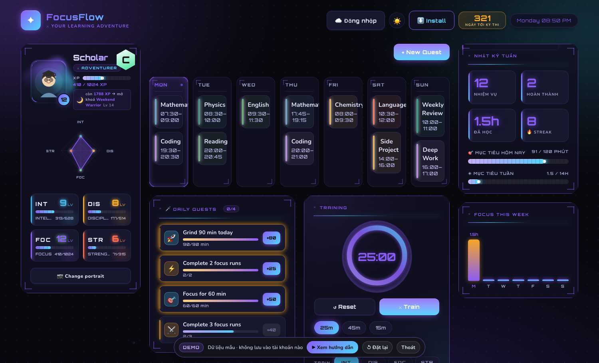

# FocusFlow

**FocusFlow** is a gamified study planner and focus timer. It helps students organize their weekly study schedule, track focused learning time, and stay motivated through XP, levels, quests, achievements, and a weekly boss battle.

The purpose of this project is to make studying feel more visible and rewarding: every focused minute becomes progress.

---

## 1. Project Structure

```text
focusflow/
├── index.html          Main app page and layout
├── app.js              Core app logic: schedule, timer, RPG system, quests, boss, UI
├── styles.css          Main styling, responsive layout, dark/light theme, game UI
├── firebase-sync.js    Firebase login and Firestore cloud sync
├── demo.html           Demo entry page
├── demo.js             Demo-mode logic and sample behavior
├── app_data.json       App data / backup data
├── firestore.rules     Firestore security rules
├── firebase.json       Firebase project configuration
├── sw.js               Service worker for PWA cache and offline support
├── manifest.json       PWA manifest
├── icon.svg            App icon
├── avatars/            Avatar images and character assets
├── music/              Focus music files
└── docs/               Extra documents, screenshots, and reference files
```

### Important files

- **`index.html`** — the main page users open.
- **`app.js`** — contains most of the app behavior: weekly schedule, timer, XP, stats, quests, boss fight, achievements, and rendering.
- **`styles.css`** — controls the full visual design, including the game-like HUD style.
- **`firebase-sync.js`** — handles Google login and cloud sync with Firebase.
- **`demo.html` / `demo.js`** — lets users try the app with demo data.
- **`app_data.json`** — stores app data used for backup/default data.
- **`sw.js`** — service worker used for PWA caching and offline behavior.
- **`docs/screenshot.png`** — screenshot used for showing the app interface.

### Main technologies

- HTML
- CSS
- Vanilla JavaScript
- Firebase Authentication
- Firebase Firestore
- Service Worker / PWA
- GitHub Pages

---

## 2. Setup, Installation, and Use Guide

To run FocusFlow on your computer, clone the repository and start a simple local web server:

```bash
git clone https://github.com/SPIDD246/focusflow.git
cd focusflow
python3 -m http.server 8000
```

Then open the app in your browser:

```text
http://localhost:8000/
```

For demo mode, open:

```text
http://localhost:8000/?demo=1
```

FocusFlow is a static web app, so there is no build step required. It can also be installed as a PWA. On desktop Chrome or Edge, open the website and use the install icon in the address bar or the browser menu. On Android, open the website in Chrome, tap the three-dot menu, and choose **Add to Home screen** or **Install app**. After installation, FocusFlow can be opened like a normal app.

The app supports cloud sync with Firebase. Depending on the setup, data can be saved in browser local storage, Firebase Firestore, or through Google account sync. This helps your schedule and progress appear again when you open the app on another device.

Because FocusFlow uses a service worker, the browser may sometimes keep an old cached version. If the app looks outdated, close all FocusFlow tabs, reopen the page, and hard refresh with **Ctrl + Shift + R**. If needed, clear site data from browser settings.

---
## 3. Demo and Image

### Demo mode

Demo mode lets users try FocusFlow without changing real study data.

Open demo mode:

```text
https://spidd246.github.io/focusflow/?demo=1
```

Demo mode is useful for:

- Testing the interface
- Showing the project to other people
- Trying the RPG features
- Exploring the app without using real progress

---

### App screenshot



---

### What users can see in the demo

The demo shows the main parts of FocusFlow:

- Weekly schedule
- Focus timer
- XP and level system
- Character stats
- Daily quests
- Weekly boss
- Achievements
- Game-style dashboard UI

---

### Final note

FocusFlow is built to help students study more consistently by making progress visible. It combines planning, time tracking, and game mechanics so that every study session feels like a step forward.
